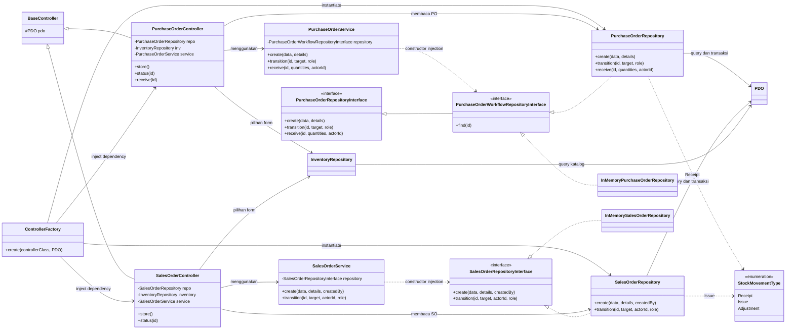
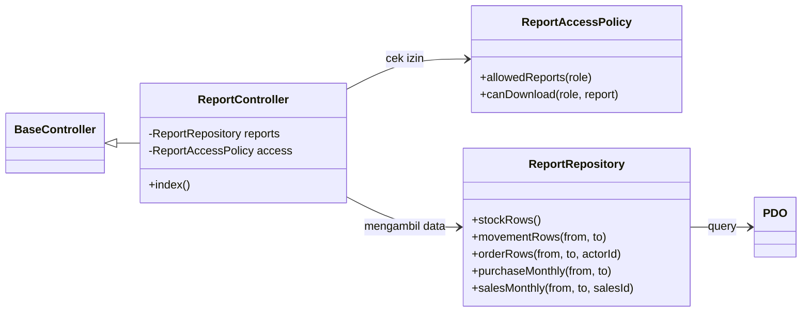

# Class Diagram As-Built — Gudang Kita

Diagram ini menggambarkan **kelas PHP yang benar-benar ada** pada aplikasi. Fokusnya adalah alur Purchase Order (PO), Sales Order (SO), dan laporan, karena alur tersebut mewakili pemisahan Controller, Service, dan Repository yang diminta brief. Diagram database dan relasi tabel berada di [ERD](../planning/erd.md).

## Alur transaksi PO dan SO

**Cara membaca panah:** `--|>` adalah pewarisan interface/kelas, `..|>` adalah implementasi interface, `-->` adalah pemakaian kelas konkret, dan `..>` adalah dependency pada kontrak atau enum. Dua kelas `InMemory...` ada di `tests/Fakes/`, bukan pada aplikasi produksi. `PurchaseOrderWorkflowRepositoryInterface` memperluas `PurchaseOrderRepositoryInterface` dengan operasi `find()`; **itulah tipe constructor** `PurchaseOrderService`. `SalesOrderService` menerima `SalesOrderRepositoryInterface`.

Saat menerima PO, `PurchaseOrderRepository` menulis `stocks` dan `stock_movements` bertipe `Receipt` dalam satu transaksi. Saat memenuhi SO, `SalesOrderRepository` mengunci baris stok (`FOR UPDATE`), menolak jumlah yang kurang, lalu menulis stok dan movement `Issue` dalam satu transaksi. `StockMovementType` adalah enum PHP; order, stok, dan ledger disimpan sebagai **tabel MySQL**, bukan kelas Entity PHP terpisah.

## Alur laporan

`ControllerFactory` di [composition root](../../app/Support/ControllerFactory.php) membuat repository dan service PO/SO, lalu menginjeksi dependency wajib ke controller. Dependency inversion berlaku pada Service PO/SO melalui interface dengan implementasi MySQL dan fake untuk test. Controller CRUD dan laporan lain masih membuat repository konkret; hal ini dicatat sebagai [technical debt](../quality/tech-debt.md). Kode rujukan: [controller PO](../../app/Controller/PurchaseOrderController.php), [controller SO](../../app/Controller/SalesOrderController.php), [service PO](../../app/Service/PurchaseOrderService.php), [service SO](../../app/Service/SalesOrderService.php), dan [kontrak repository](../../app/Contract/).

Perbandingan dengan [diagram rancangan retrospektif](../planning/class-diagram-initial.md): rancangan konseptual hanya menunjukkan tiga layer dan kontrak repository. Implementasi as-built menambah pemisahan kontrak PO untuk `find()`, repository baca katalog, enum tipe movement, dan fake untuk unit test. Perbandingan ini menjelaskan perubahan desain, **bukan bukti** adanya diagram initial yang dibuat sebelum coding.
