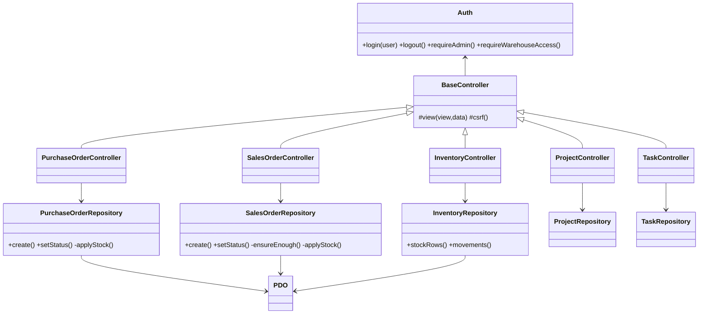

# Class Diagram

```mermaid
classDiagram
    class Auth { +login(user) +logout() +requireAdmin() +requireWarehouseAccess() }
    class BaseController { #view(view,data) #csrf() }
    class PurchaseOrderController
    class SalesOrderController
    class InventoryController
    class ProjectController
    class TaskController
    class PurchaseOrderRepository { +create() +setStatus() -applyStock() }
    class SalesOrderRepository { +create() +setStatus() -ensureEnough() -applyStock() }
    class InventoryRepository { +stockRows() +movements() }
    class ProjectRepository
    class TaskRepository
    class PDO

    BaseController <|-- PurchaseOrderController
    BaseController <|-- SalesOrderController
    BaseController <|-- InventoryController
    BaseController <|-- ProjectController
    BaseController <|-- TaskController
    PurchaseOrderController --> PurchaseOrderRepository
    SalesOrderController --> SalesOrderRepository
    InventoryController --> InventoryRepository
    ProjectController --> ProjectRepository
    TaskController --> TaskRepository
    PurchaseOrderRepository --> PDO
    SalesOrderRepository --> PDO
    InventoryRepository --> PDO
    Auth <-- BaseController
```

Controller menerima request dan menentukan authorization. Repository menjalankan query serta transaksi database. View hanya merender data yang diterima dari controller.
