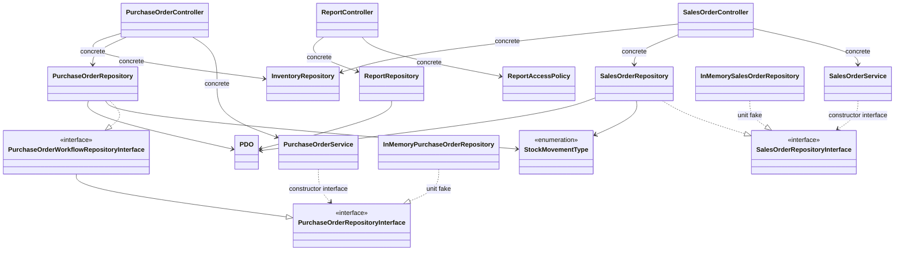

# Class Diagram As-Built — Gudang Kita

Diagram ini mengikuti kelas yang tersedia pada kode saat ini. Panah `..|>` berarti implementasi interface; panah `-->` berarti penggunaan kelas konkret; panah `..>` menunjukkan Service menerima kontrak melalui constructor.

Service hanya mengetahui kontrak repository. Implementasi MySQL menyimpan perubahan order, stok, dan ledger di dalam transaksi; fake digunakan oleh unit test tanpa MySQL. Controller saat ini masih menerima atau membuat beberapa repository konkret karena composition root manual belum diterapkan secara menyeluruh.

Diagram initial historis belum ditemukan. Karena itu, perubahan waktu antara diagram sebelum coding dan diagram as-built tidak dapat dibuktikan; [catatan diagram awal](../planning/class-diagram-initial.md) mencatat keterbatasan tersebut.
