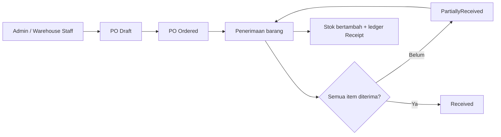
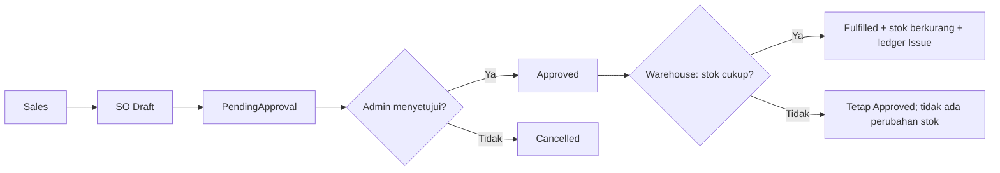
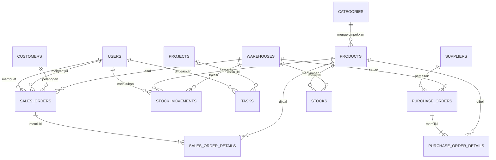
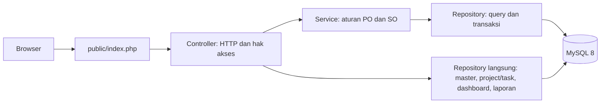

# Dokumentasi Aplikasi — Gudang Kita

## Tujuan dan modul

Gudang Kita adalah aplikasi web untuk mengelola produk, pembelian, penjualan, dan stok di beberapa gudang. Penerimaan dan pengeluaran barang dicatat pada ledger agar perubahan saldo dapat ditelusuri. Modul project dan task membantu Admin membagi pekerjaan kepada Sales; modul ini terpisah dari perhitungan stok.

Aplikasi menggunakan PHP 8.2 native, MySQL 8, HTML/CSS, dan JavaScript. Login menggunakan email, password hash, dan session. Pemeriksaan hak akses dilakukan di server. **Customer dan supplier adalah master data transaksi, bukan akun yang dapat login.**

| Peran | Tanggung jawab utama |
| --- | --- |
| Admin | Mengelola master data, pengguna, project dan task; meninjau SO; dapat membuat PO dan menerima barang; melihat seluruh laporan. |
| Sales | Membuat dan mengajukan SO miliknya, melihat order serta laporan order miliknya, dan mengubah status task yang ditugaskan. |
| Warehouse Staff | Membuat PO, menerima barang, memenuhi SO yang sudah disetujui, serta melihat stok dan ledger. |

Sales tidak dapat menyetujui SO, termasuk SO yang dibuatnya sendiri. Petugas gudang tidak dapat memproses SO sebelum Admin menyetujuinya.

## Alur pembelian sampai stok masuk

1. Admin atau Warehouse Staff membuat PO berisi supplier, gudang tujuan, produk, jumlah, dan harga. Status awalnya `Draft`; stok belum berubah. PO pada tahap ini dapat dibatalkan.
2. PO diubah menjadi `Ordered`. Status ini juga belum mengubah stok.
3. Saat barang diterima, petugas memasukkan jumlah aktual pada tiap item. Aplikasi menambah `received_qty`, `stocks.current_stock` dan `stocks.stock_in`, lalu menulis satu `stock_movements` bertipe `Receipt` per item yang diterima.
4. Jika masih ada sisa barang yang belum datang, PO menjadi `PartiallyReceived`. Penerimaan berikutnya dapat dilakukan sampai status `Received`.
5. Pembaruan item, stok, ledger, dan status berada dalam satu transaksi database. Jika satu langkah gagal, seluruh penerimaan dibatalkan.

## Alur penjualan sampai stok keluar

1. Sales membuat SO untuk customer dan gudang asal. Status awal `Draft`; stok belum berubah.
2. Sales mengajukan SO menjadi `PendingApproval`. Admin menyetujui menjadi `Approved` atau membatalkannya menjadi `Cancelled`. Alasan pembatalan belum disimpan sebagai field tersendiri.
3. Warehouse Staff memproses SO `Approved`. Aplikasi mengunci baris stok produk-gudang dan memeriksa jumlah tersedia.
4. Jika stok mencukupi, aplikasi menambah `stocks.stock_out`, mengurangi `stocks.current_stock`, mencatat movement `Issue`, dan mengubah SO menjadi `Fulfilled` dalam satu transaksi.
5. Jika stok kurang, transaksi dibatalkan: SO tetap `Approved`, saldo tidak berkurang, dan movement `Issue` tidak dibuat.

## Stok dan riwayat pergerakan

`stocks` menyimpan saldo per pasangan produk–gudang. `stock_movements` menyimpan tanggal, produk, gudang, jumlah, tipe, nomor referensi, dan aktor jika diketahui. Database hasil seed baru membuat baris stok untuk seluruh pasangan. Pada 6 Oktober, database latihan aktif juga dilengkapi dengan 807 pasangan yang sebelumnya kosong; seluruh pasangan kini memiliki baris stok. Pasangan tambahan bersaldo nol dan tidak dibuatkan movement fiktif.

| Tipe | Kapan dibuat | Pengaruh pada saldo |
| --- | --- | --- |
| `Receipt` | Penerimaan PO, termasuk sebagian | Bertambah |
| `Issue` | SO berhasil dipenuhi | Berkurang |
| `Adjustment` | Rekonsiliasi saldo awal data lama | Bertambah atau berkurang menurut `adjustment_direction` |

Database aktif berasal dari data sebelum ledger lengkap diterapkan. Pada 5 Oktober 2026, selisih antara saldo saat itu dan movement historis yang tersisa dicatat sebagai `Adjustment` berlabel `LEGACY-BASE-*`. Entri ini adalah **saldo awal rekonsiliasi**, bukan PO/SO yang dibuat belakangan. Saldo dan order lama tidak diubah; rincian transaksi serta aktor historis yang hilang tetap tidak dapat dipulihkan. Counter lama `stock_in`/`stock_out` tidak boleh dianggap sama persis dengan jumlah baris Receipt/Issue yang masih tersedia.

Pada pemeriksaan sebelum pelengkapan pasangan, **93 baris stok yang sudah ada** cocok dengan penjumlahan ledger: `Receipt − Issue + Adjustment Masuk − Adjustment Keluar` (0 selisih). Setelah backup, 807 pasangan tanpa movement ditambah dengan saldo nol; totalnya menjadi **900 baris** untuk 30 produk × 30 gudang. Untuk transaksi baru, aktor penerimaan/pengeluaran dicatat saat operasi dijalankan.

**Contoh alur stok:** bila suatu produk memiliki saldo 10 unit pada Gudang A, penerimaan 5 unit melalui PO membuat saldo 15 dan movement `Receipt` sebanyak 5. Ketika SO yang telah disetujui dipenuhi sebanyak 3 unit dari Gudang A, saldo menjadi 12 dan movement `Issue` sebanyak 3. SO yang baru dibuat atau baru disetujui belum mengurangi stok. Angka ini contoh penjelasan, bukan klaim saldo pada database aktif.

## Project dan task

Admin dapat membuat project, menetapkan rentang tanggal, lalu membuat task dengan prioritas dan tenggat untuk akun Sales. Sales melihat project dan task yang terkait dengannya serta mengubah status task miliknya (`To Do`, `In Progress`, `Done`). Warehouse Staff tidak mengakses modul ini. Perubahan task **tidak mengubah stok**; relasinya hanya `projects` → `tasks` → `users`.

## ERD ringkas

`stocks` memiliki unique key `(product_id, warehouse_id)` dan constraint saldo tidak negatif. Satu order dapat mempunyai banyak item. `sales_orders.created_by` dan `approved_by` mengacu ke user; `stock_movements.created_by` dapat kosong untuk data lama atau seed. Movement memakai `transaction_type` dan `transaction_id` sebagai referensi PO/SO; saldo awal rekonsiliasi memakai `transaction_id = 0` dan nomor `LEGACY-BASE-*` agar tidak disalahartikan sebagai order.

## Arsitektur dan fitur pendukung

Service PO/SO menerima kontrak repository sehingga aturan dasarnya dapat diuji tanpa MySQL. `ControllerFactory` menginjeksi service dan repository ke kedua controller order. Beberapa controller lain masih membuat repository konkret secara langsung; [diagram kelas as-built](architecture/class-diagram.md) menunjukkan hubungan yang benar-benar ada.

- **Laporan:** Admin dapat mengunduh stok, order, dan ledger; Sales hanya order miliknya; Warehouse Staff stok dan ledger. Filter tanggal berlaku untuk order dan ledger, sedangkan laporan stok menunjukkan saldo saat ini.
- **API:** `GET /api/products/{sku}/availability` mengembalikan JSON stok per gudang untuk produk aktif. Tanpa login responsnya `401`, dan SKU yang tidak ditemukan `404`.
- **Pemeriksaan stok rendah:** `scripts/check-low-stock.php` berjalan terpisah dari request web dan dapat dipanggil melalui Docker.
- **Operasional:** Docker Compose utama menjalankan PHP dan MySQL. Prometheus, Grafana, dan Alertmanager menggunakan file Compose observability terpisah. `/health/ready` dan `/metrics` tersedia untuk pemantauan. Manifest Kubernetes dan chart Helm juga tersedia sebagai konfigurasi deployment, bukan bukti bahwa lingkungan Docker Compose sedang berjalan di Kubernetes.
- **Kualitas:** pengujian terakhir mencatat 33 unit test, 9 integration test MySQL, PHPStan level 5 tanpa error, dan SonarQube dengan quality gate lulus serta 0 issue terbuka pada source 6 Oktober. Tag rilis teknis `v1.0.1` menunjuk revisi ini; [catatan Sonar](quality/sonarqube-2026-10-06.md) memisahkan hasil tag lama dan sumber terbaru.

Diagram kelas tersedia pada [arsitektur as-built](architecture/class-diagram.md), sedangkan [audit brief](planning/project-brief-compliance.md) mencatat bukti dan keterbatasan yang belum selesai.

## Kondisi data saat ini

Seed untuk instalasi baru berisi 30 produk, dua gudang, 13 PO, 12 SO, dan akun untuk tiga role. Pada pemeriksaan database latihan aktif **6 Oktober 2026**, terdapat 30 produk, 30 gudang, 35 PO, 33 SO, dan 64 movement. Setelah [pelengkapan pasangan stok](../database/ensure-stock-pairs.sql), jumlah baris stok menjadi **900** tanpa pasangan yang hilang. Ada satu PO `PartiallyReceived` serta satu SO `PendingApproval`. Data aktif dapat berubah; jangan memakai nomor internal sebagai identitas tetap dalam dokumentasi atau presentasi.

Untuk database aktif, jangan jalankan ulang [schema dan seed](../database/schema-and-seed.sql) karena skrip tersebut menghapus dan membuat ulang tabel. Backup sebelum migrasi tersedia secara lokal. Bukti uji dan bagian yang masih perlu diperiksa dijelaskan dalam [checklist final project](planning/checklist-final-project.md).
