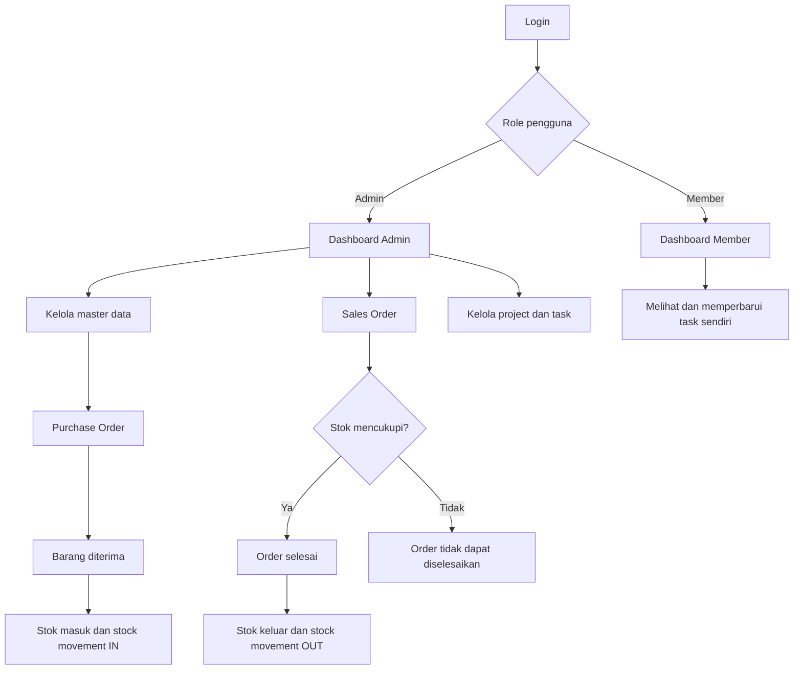
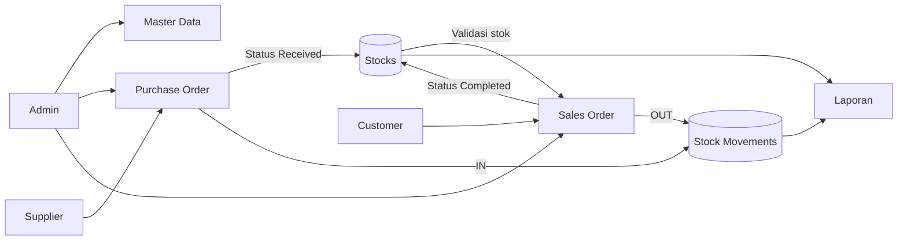
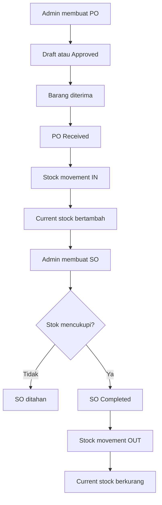
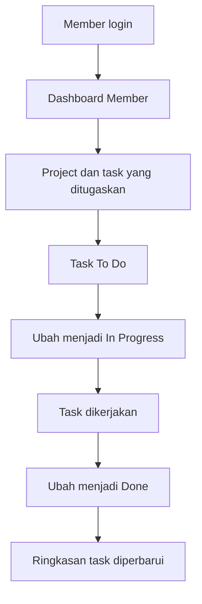
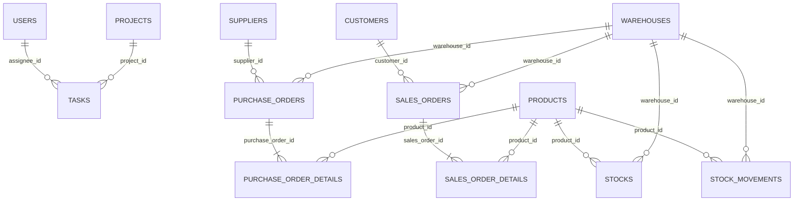
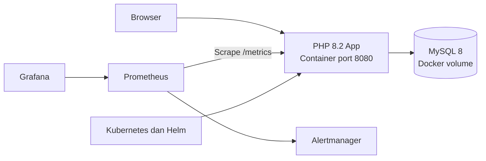

# Dokumentasi Aplikasi — Gudang Kita

## Gambaran aplikasi

Gudang Kita adalah aplikasi web untuk pengelolaan persediaan dan aktivitas project. Aplikasi menyimpan data produk, transaksi pembelian dan penjualan, stok per gudang, serta project dan task dalam satu sistem.

Tujuannya adalah menyediakan data operasional terpusat, mencatat perubahan stok, mencegah stok bernilai minus, dan membantu pengelolaan pekerjaan member.

## Modul aplikasi

| Modul | Fungsi |
| --- | --- |
| Autentikasi | Login, logout, sesi, CSRF, dan password hash. |
| Master Data | Produk, customer, supplier, gudang, serta pengguna. Kode master dibuat otomatis. |
| Purchase Order | Pencatatan pembelian barang dari supplier. |
| Sales Order | Pencatatan penjualan barang kepada customer. |
| Inventory | Stok per produk-gudang, stok minimum, dan stock movement. |
| Project dan Task | Project, task, prioritas, due date, status, dan overdue. |
| Laporan | Ringkasan stok, purchase order, dan sales order. |
| Operasional | Docker, Prometheus, Grafana, Alertmanager, SonarQube, Kubernetes, dan Helm. |

## Hak akses pengguna

| Role | Akses |
| --- | --- |
| Admin | Mengelola master data, transaksi, inventory, user, project, task, dan laporan. |
| Member | Mengakses project dan task yang ditugaskan kepadanya serta memperbarui status task miliknya. |

Member tidak memiliki akses ke master data, Purchase Order, Sales Order, dan pengaturan user.

## Alur sistem

## Flowmap persediaan

## Proses Purchase Order hingga Sales Order selesai

1. Admin memilih supplier, gudang, produk, kuantitas, dan harga pada Purchase Order.
2. PO dapat disimpan sebagai `Draft` atau `Approved`; stok belum berubah.
3. Saat barang diterima, Admin mengubah status PO menjadi `Received`.
4. Sistem menambah `stock_in` dan `current_stock`, lalu membuat stock movement `IN` untuk setiap produk.
5. Admin membuat Sales Order dengan customer, gudang, dan detail produk.
6. Sistem memeriksa `current_stock` sebelum SO diselesaikan.
7. Saat SO berubah menjadi `Completed`, sistem menambah `stock_out`, mengurangi `current_stock`, dan membuat stock movement `OUT`.
8. Apabila stok tidak mencukupi, SO tidak dapat diselesaikan sehingga stok tidak negatif.

## Proses kerja Member

1. Member login ke aplikasi.
2. Dashboard Member menampilkan project dan task yang ditugaskan kepadanya.
3. Member membuka task dan memperbarui status dari `To Do` ke `In Progress` lalu `Done`.
4. Dashboard memperbarui ringkasan jumlah task berdasarkan status terbaru.

## Stock movement

Stock movement adalah histori setiap perubahan persediaan. Data ini menyimpan jenis transaksi, nomor transaksi, produk, gudang, kuantitas, dan waktu perubahan.

| Sumber transaksi | Status | Tipe movement | Perubahan stok |
| --- | --- | --- | --- |
| Purchase Order | `Received` | `IN` | Stok masuk dan saldo stok bertambah. |
| Sales Order | `Completed` | `OUT` | Stok keluar dan saldo stok berkurang. |
| Draft, Approved, Confirmed | Belum final | Tidak dibuat | Saldo stok tidak berubah. |

## ERD

- Satu project memiliki banyak task; satu user dapat menjadi assignee banyak task.
- Satu Purchase Order dan Sales Order memiliki banyak baris detail produk.
- Stok disimpan berdasarkan pasangan produk dan gudang.
- Stock movement mencatat barang masuk dan keluar per produk serta gudang.
- Constraint `current_stock >= 0` menjaga saldo stok tetap valid.

## Arsitektur aplikasi

Aplikasi dijalankan dengan Docker Compose. Service aplikasi memakai PHP 8.2, service database memakai MySQL 8, dan data database disimpan pada Docker volume. Endpoint health dan metrics digunakan untuk memantau aplikasi serta koneksi database.

## Keamanan dan konfigurasi

- Password pengguna disimpan menggunakan hash.
- Form penting menggunakan token CSRF.
- Akses menu dan aksi dibatasi sesuai role pengguna.
- Query database menggunakan PDO prepared statement.
- Konfigurasi lokal dan secret disimpan di `.env`.
- Repository hanya menyimpan `.env.example` sebagai contoh konfigurasi.

## Struktur teknis

Arsitektur menerapkan pemisahan controller, repository, view, validation, dan security. Diagram class tersedia pada [class-diagram.md](architecture/class-diagram.md). Catatan perubahan teknis tersedia pada [refactoring-log.md](planning/refactoring-log.md).

Endpoint `health/ready` mengembalikan JSON dan dipanggil menggunakan Fetch API untuk menampilkan status aplikasi serta database pada dashboard.
