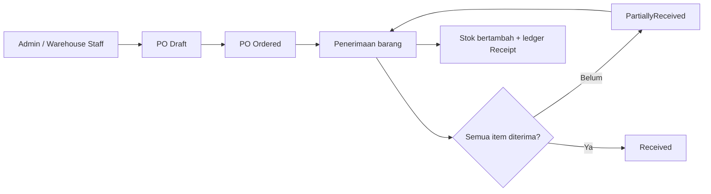
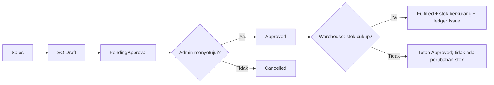
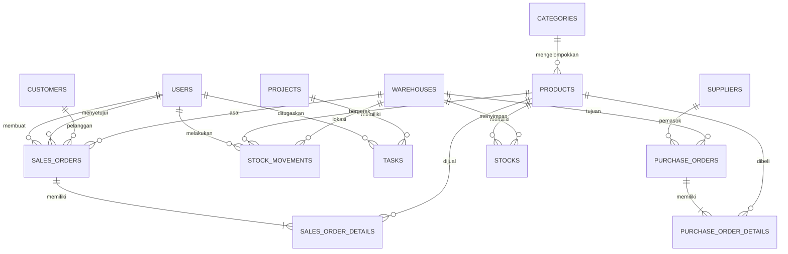

# Dokumentasi Aplikasi — Gudang Kita

## Tujuan dan modul

Gudang Kita mengelola produk, gudang, pembelian, penjualan, saldo stok per lokasi, serta project dan task. Perubahan stok dicatat sebagai riwayat pergerakan agar saldo dan sumbernya dapat diperiksa. Aplikasi juga menyediakan laporan CSV, endpoint ketersediaan produk, dan pemeriksaan stok rendah.

| Peran | Tanggung jawab utama |
| --- | --- |
| Admin | Mengelola master data dan user, menyetujui atau membatalkan SO, melihat seluruh laporan. |
| Sales | Membuat dan mengajukan SO miliknya, melihat order dan laporan order miliknya, mengerjakan task yang ditugaskan. |
| Warehouse Staff | Membuat PO, menerima barang, memenuhi SO yang disetujui, melihat stok dan ledger. |

Login memakai email dan password yang di-hash. Pemeriksaan role berlaku di server; Sales tidak dapat menyetujui SO sendiri.

## Alur pembelian sampai stok masuk

1. Admin atau Warehouse Staff membuat PO berisi supplier, gudang tujuan, produk, jumlah, dan harga. Status awalnya `Draft`; stok belum berubah.
2. PO dikirim menjadi `Ordered`. Status ini juga belum mengubah stok.
3. Saat barang diterima, petugas memasukkan jumlah aktual pada tiap item. Aplikasi menambah `received_qty`, `stocks.current_stock` dan `stocks.stock_in`, lalu menulis satu `stock_movements` bertipe `Receipt` per item yang diterima.
4. Jika masih ada sisa barang yang belum datang, PO menjadi `PartiallyReceived`. Penerimaan berikutnya dapat dilakukan sampai status `Received`.
5. Pembaruan item, stok, ledger, dan status berada dalam satu transaksi database. Jika satu langkah gagal, seluruh penerimaan dibatalkan.

## Alur penjualan sampai stok keluar

1. Sales membuat SO untuk customer dan gudang asal. Status awal `Draft`; stok belum berubah.
2. Sales mengajukan SO menjadi `PendingApproval`. Admin menyetujui menjadi `Approved` atau membatalkannya. Pemeriksaan peran dilakukan pada server.
3. Warehouse Staff memproses SO `Approved`. Aplikasi mengunci baris stok produk-gudang dan memeriksa jumlah tersedia.
4. Jika stok mencukupi, aplikasi menambah `stocks.stock_out`, mengurangi `stocks.current_stock`, mencatat movement `Issue`, dan mengubah SO menjadi `Fulfilled` dalam satu transaksi.
5. Jika stok kurang, transaksi dibatalkan: SO tetap `Approved`, saldo tidak berkurang, dan movement `Issue` tidak dibuat.

## Stok dan riwayat pergerakan

`stocks` menyimpan satu saldo untuk setiap pasangan produk-gudang. `stock_movements` menyimpan tanggal, produk, gudang, jumlah, tipe, nomor referensi, dan aktor jika diketahui.

| Tipe | Kapan dibuat | Pengaruh pada saldo |
| --- | --- | --- |
| `Receipt` | Penerimaan PO, termasuk sebagian | Bertambah |
| `Issue` | SO berhasil dipenuhi | Berkurang |
| `Adjustment` | Rekonsiliasi saldo awal data lama | Bertambah atau berkurang menurut `adjustment_direction` |

Database aktif berasal dari data sebelum ledger lengkap diterapkan. Pada 5 Oktober 2026, selisih antara saldo saat itu dan movement historis yang tersisa dicatat sebagai `Adjustment` berlabel `LEGACY-BASE-*`. Entri ini adalah **saldo awal rekonsiliasi**, bukan PO/SO yang dibuat belakangan. Saldo dan order lama tidak diubah; rincian transaksi serta aktor historis yang hilang tetap tidak dapat dipulihkan. Counter lama `stock_in`/`stock_out` tidak boleh dianggap sama persis dengan jumlah baris Receipt/Issue yang masih tersedia.

Setelah rekonsiliasi, saldo setiap pasangan produk-gudang cocok dengan penjumlahan ledger bersih: `Receipt − Issue + Adjustment Masuk − Adjustment Keluar`. Untuk transaksi baru, aktor penerimaan/pengeluaran dicatat saat operasi dijalankan.

## ERD ringkas

`stocks` memiliki unique key `(product_id, warehouse_id)` dan constraint saldo tidak negatif. Satu order dapat mempunyai banyak item. Movement memakai `transaction_type` dan `transaction_id` sebagai referensi PO/SO; saldo awal rekonsiliasi memakai `transaction_id = 0` dan nomor `LEGACY-BASE-*` agar tidak disalahartikan sebagai order.

## Fitur pendukung dan operasional

- Laporan stok, status order, dan ledger dapat diekspor sebagai CSV sesuai hak akses peran.
- Endpoint `GET /api/products/{sku}/availability` mengembalikan JSON stok per gudang dengan pemeriksaan autentikasi.
- Script `scripts/check-low-stock.php` menampilkan produk di bawah batas minimum.
- Docker Compose menjalankan aplikasi PHP dan MySQL; Prometheus, Grafana, dan Alertmanager tersedia melalui konfigurasi observability terpisah.
- Diagram kelas dan keputusan arsitektur tersedia pada [docs/architecture](architecture/); hasil pemeriksaan brief ada di [audit kepatuhan](planning/project-brief-compliance.md).

Pada database latihan aktif, PO nomor internal `52` berstatus `PartiallyReceived` dan SO nomor internal `34` berstatus `PendingApproval`. Nomor dapat berbeda pada instalasi baru. Data contoh dibuat melalui service aplikasi sehingga relasi item, stok, dan ledger mengikuti aturan yang sama dengan permintaan dari UI.
