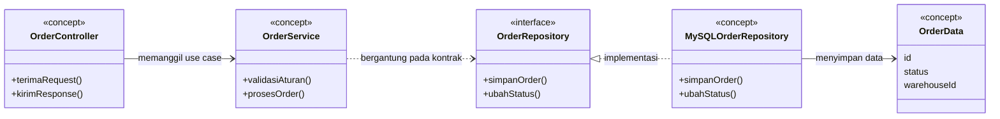

# Rancangan Kelas Retrospektif — Gudang Kita

**Status bukti:** diagram ini disusun **setelah aplikasi berjalan**, berdasarkan tujuan desain yang dapat dibaca dari kode dan ADR. Ini membantu menjelaskan rancangan yang sederhana, tetapi **bukan** diagram *initial* yang dibuat sebelum coding sebagaimana diminta DESIGN-01. Artefak awal historis belum ditemukan; jangan menyajikan diagram ini sebagai bukti dari masa sebelum implementasi.

Nama dalam diagram ini **konsep umum**, bukan nama kelas pada source. Diagram [as-built](../architecture/class-diagram.md) adalah rujukan yang benar untuk menelusuri kelas saat ini. Dalam implementasi nyata, controller dan repository terpisah untuk PO/SO; service menerima interface yang berbeda; data order tersimpan pada tabel MySQL, dan satu-satunya `app/Entity` terkait ledger saat ini adalah enum `StockMovementType`.

Jika ada sketsa atau berkas diagram yang benar-benar dibuat sebelum coding, simpan artefak aslinya bersama tanggal/provenansinya di `docs/planning/`, lalu ganti catatan status ini. Sampai saat itu, kriteria **initial sebelum coding** tetap belum terpenuhi.
