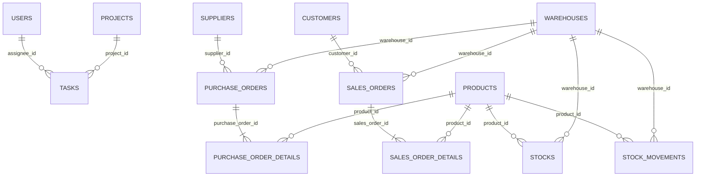

# ERD

ERD ringkas terbaru tersedia pada [dokumentasi aplikasi](../dokumentasi-summary.md#erd-ringkas). Relasi utama basis data:

`stocks` memiliki unique key `(product_id, warehouse_id)` agar satu produk hanya mempunyai satu saldo pada satu gudang. Constraint `current_stock >= 0` menjaga stok tidak negatif.
